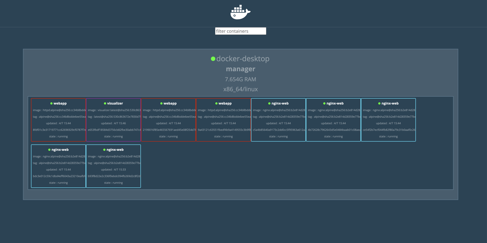

##  Install Docker Swarm visualizer to see your nodes and services graphically.

1. Initialize the docker swarm

`docker swarm init`

2. Create a container named visualizer and bind it to port 8080:

`
docker service create \
  --name=visualizer \
  --publish=8081:8080 \
  --constraint=node.role==manager \
  --mount=type=bind,src=/var/run/docker.sock,dst=/var/run/docker.sock \
  dockersamples/visualizer
`

`
at0y2b5aqj355pxn737rrsvl8
overall progress: 1 out of 1 tasks 
1/1: running   [==================================================>] 
verify: Service at0y2b5aqj355pxn737rrsvl8 converged 
`

### Output :

